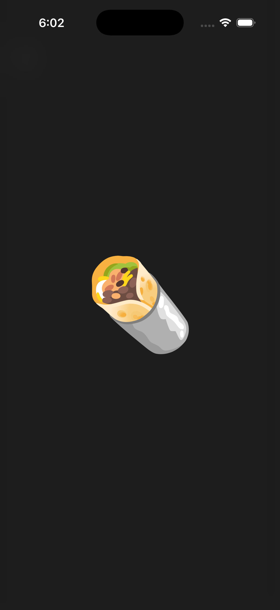
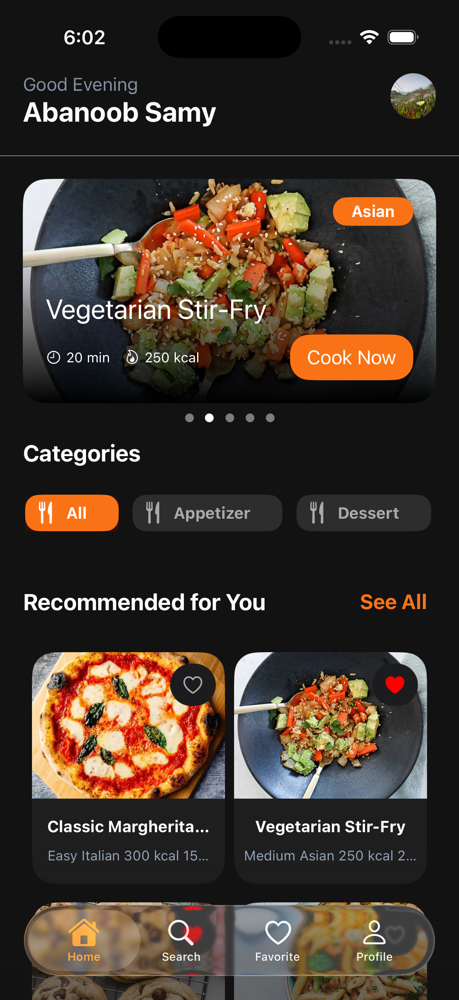
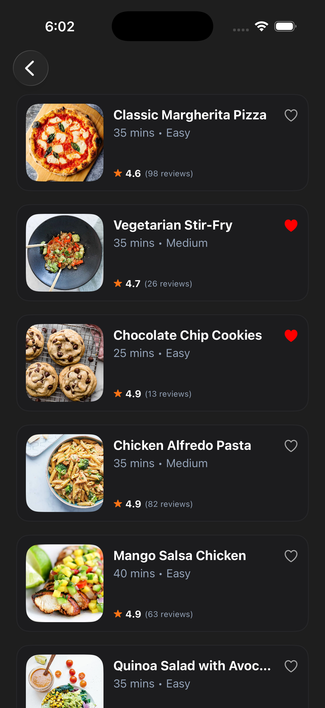
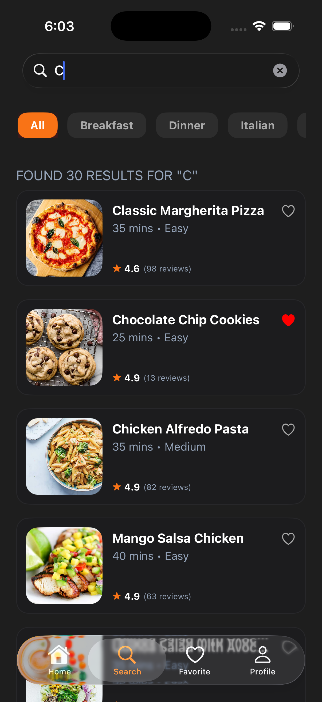
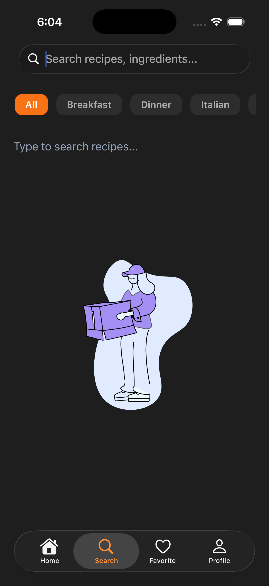
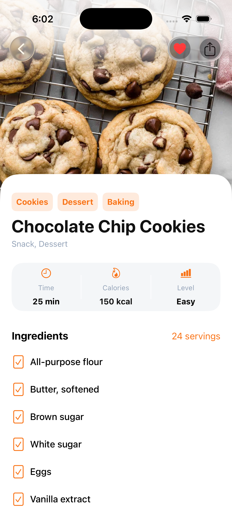
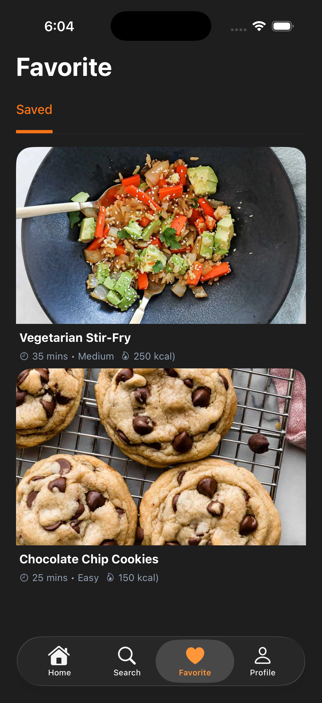
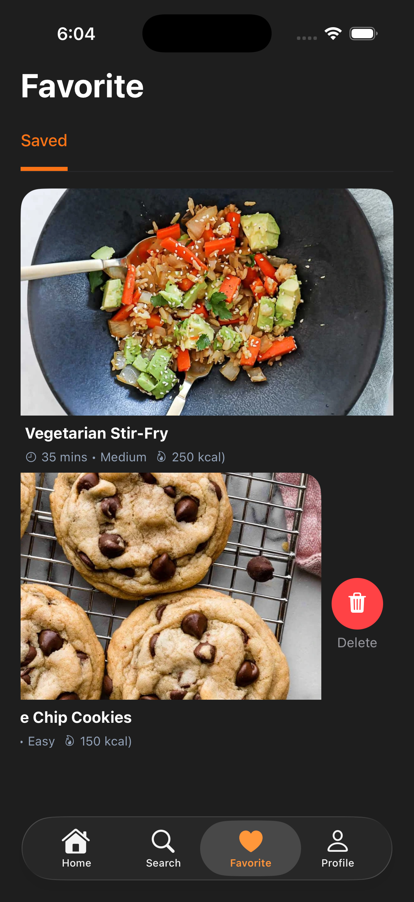
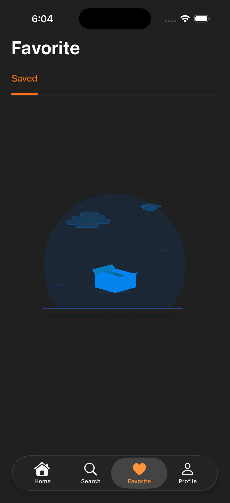

# 🍲 RecipeStream
**RecipeStream** is a modern, reactive iOS application built using **RxSwift** and **MVVM** architecture. It allows users to discover, search, and save their favorite recipes with a seamless and interactive user experience.

---

## 📸 Screenshots
<p align="center">
  
  
  
  
  
  
  
  
  
</p>

---

## ✨ Features
* **Discover Recipes:** Explore a wide variety of meals with detailed information.
* **Advanced Search:** Search by keywords and filter by categories (Appetizer, Dessert, etc.).
* **Favorites System:** Save your preferred recipes locally and sync with **Firebase Firestore**.
* **Interactive UI:** Smooth animations using **Lottie**, and custom transitions for image viewing.
* **Modern Layouts:** Built with **UICollectionView Compositional Layout** and **Diffable Data Sources**.
* **Reactive Programming:** Fully powered by **RxSwift** for data binding and state management.

---

## 🛠 Tech Stack & Architecture
* **Language:** Swift
* **Architecture:** MVVM (Model-View-ViewModel)
* **Reactive Framework:** RxSwift & RxCocoa
* **Backend & Auth:** Firebase (Auth, Firestore)
* **Networking:** Alamofire / URLSession
* **Image Loading:** Kingfisher
* **Animations:** Lottie
* **UI Components:** Compositional Layout, Modern CollectionView Lists

---

## 🚀 How to Run
1. Clone the repository:
   ```bash
   git clone [https://github.com/abanoob-900/RecipeStream.git](https://github.com/abanoob-900/RecipeStream.git)

